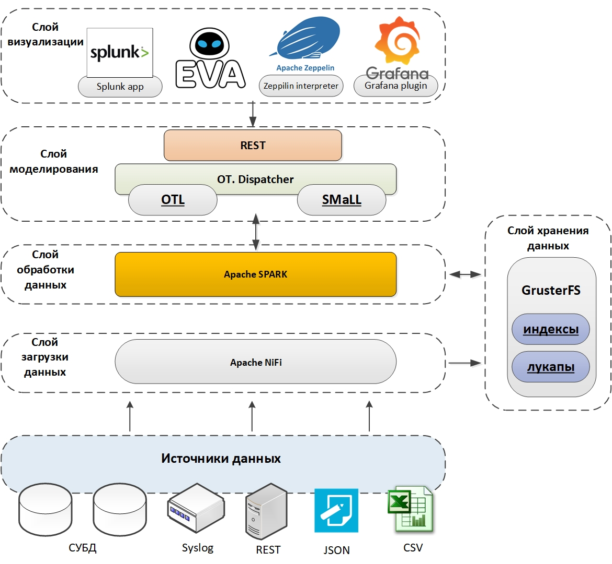

# Общее описание

**WDC.Платформа** – это универсальная система сбора, аналитики и визуализации больших объемов машинных данных (machine-generated data), построенная на базе стека программных продуктов с открытым исходным кодом и компонентов собственной разработки. Разработчик WDC.Платформы – российская компания ISG Neuro.

Ключевой особенностью WDC.Платформы является минимальный барьер входа для пользователей системы, то есть возможность использовать самые современные технологии машинного обучения, аналитики больших данных и распределенной обработки информации с минимальными затратами на изучение этих технологий.

Функции аналитики не ограничиваются быстрыми манипуляциями с данными, но также включают в себя возможности построения моделей с использованием библиотек машинного обучения, в том числе нейросетевых, работающих на графических процессорах. В системе имеется возможность создания Объектных моделей для различных предметных областей – специализированных графовых структур для построения универсального описания сущностей конкретной предметной области. Использование Объектных моделей позволяет датасаентистам работать с уже подготовленными, хорошо формализованными данными и эффективно использовать накопленный ранее опыт анализа данных в новой предметной области.

Компоненты платформы позволяют визуализировать полученные данные как с использованием встроенных инструментов, так и с помощью практически любых внешних систем визуализации.

# Компоненты WDC.Платформы

Архитектура Платформы представлена на рисунке:

Ниже описываются основные компоненты WDC.Платформы.

## Визуализация

В WDC.Платформе "из коробки" реализована концепция альтернативной визуализации со встроенной поддержкой Apache Zeppelin, Splunk Search Head и собственной среды EVA.

**EVA** – разработанная компанией ISG Neuro интерактивная среда визуализации, уникальная в своём роде тем, что объединяет императивный и декларативный подходы к организации описания интерфейса пользователя и позволяющая реализовать сложную логику интерактивных дашбордов без программирования.

Предназназначена как для предварительного интерактивного исследования данных, так и для максимально простого построения конечных дашбордов высокого уровня сложности.

Функционально состоит из:

- Инструмента анализа данных с возможностью экспорта результатов анализа в виде готового к применению в продуктивной среде дашборда.
    
- Среды управления дашбордами.
    

**Apache Zeppelin** – популярное Open-Source решение компании Apache, предназначенное для реализации единого интерфейса визуализации данных, полученных в результате их анализа различными инструментами.

## Моделирование

Функционал моделирования в WDC.Платформе предоставляется пользователю в виде двух специализированных языков обработки данных: [ОТL](http://127.0.0.1:1080/1.2.0.beta/General/General_description/General_description/#_f4wyaupv9jsc) и [SMaLL](http://127.0.0.1:1080/1.2.0.beta/General/General_description/General_description/#_11p2caloms4s).

### Язык OTL

OTL – язык низкоуровневой работы с данными для организации конвейерной (по типу вызова цепочки связанных через потоки ввода-вывода утилит в unix/linux) их обработки.

Изначально разрабатывался на основе языка SPL компании Splunk и является по большинству функций обратно совместимым с ним.

Язык OTL обеспечивает крайне эффективное решение целого ряда задач обработки, прежде всего данных в виде машинно-сгенерированных журналов – логов. Основными функциями языка являются:

- полнотекстовый поиск и фильтрация по всему содержимому сообщений;
    
- выделение и поиск по выделенным полям;
    
- агрегация;
    
- объединение;
    
- обогащение данных по внешним или внутренним источникам;
    
- расчёт статистических показателей;
    
- математические преобразования данных;
    
- подготовка данных для отображения в конкретных видах визуализации;
    
- обучение и применение моделей машинного обучения из широкого набора открытых библиотек.
    

Фундаментальной особенностью OTL является высокая эффективность использования возможностей распараллеливания вычислений по кластеру вычислительных ресурсов как в режиме, близком к реальному времени (near real-time), так и в режиме пакетной обработки (batch processing).

### Язык SMaLL

SMaLL (Simple Machine Learning Language) – язык, расширяющий возможности OTL и позволяющий использовать все возможности WDC.Платформы без знаний в области машинного обучения или инженерии данных.

Основной идеей SMaLL является приведение решения большинства аналитических задач к трём стандартным фиксированным последовательностям конвейера команд – паттернам:

- Паттерн обучения модели (GetData | Fit | Explain | Score | Show).
    
- Паттерн применения модели (GetData | Apply | Score | Show).
    
- Паттерн работы со справочниками (GetData | Eval | Put).
    

Данные последовательности постоянны и отличаются только указанием в качестве операндов различных профилей – выделенных областей, под которые сформированы наборы плагинов – специализированных препроцессоров данных и алгоритмов машинного обучения, специфичных для конкретной области знания.

Такой подход позволяет скрыть от конечного пользователя рутинные подробности работы с данными и сконцентрировать его усилия на достижении конечного результата.

Особенностью SMaLL является наличие обязательной команды _Explain_, которая интерпретирует модель машинного обучения и представляет её в понятном человеку виде, что позволяет не только понять и скорректировать получившуюся модель, но и привнести в неё знания, известные человеку, но недоступные в конкретном наборе обучающих данных.

## Обработка данных

Основой вычислительных возможностей WDC.Платформы является движок Apache Spark, которые обеспечивает эффективную реализацию параллельных вычислений и быстрого доступа к информации, распределённой по различным точкам хранения.

Кроме непосредственно вычислений Apache Spark позволяет использовать и расширять возможности системы за счёт постоянно развивающегося набора библиотек машинного обучения, создаваемых участниками сообщества этого продукта.

Языки SMaLL и OTL являются надстройками над функционалом Apache Spark и обеспечивают существенное снижение барьера входа для применения возможностей этого инструмента.

## Хранение данных

Основной идеей организации хранения данных в WDC.Платформе является концепция No DataBase. Данная концепция позволяет не строить систему на основе одной или нескольких специализированных под конкретные задачи БД, а реализовать её в виде эффективного распределённого Хранилища, обеспечивающего требуемый уровень производительности, надёжности и масштабируемости, поверх которого реализуется гибридная БД, основанная на расчёте всех требуемых для эффективной работы с конкретными данными индексов и агрегирующих структур. Это позволяет унаследовать достоинства всех эффективных структур хранения и минимизировать влияние их недостатков.

В текущей реализации подсистемы хранения используется распределённая файловая система GlusterFS, а в качестве оптимального формата хранения данных в гибридной БД – формат Apache Parquet.

Такой подход гарантирует возможность горизонтального масштабирования при увеличении объемов хранимых данных и высокую надёжность итоговой системы.

При возникновении необходимости обработки особенно больших объёмов исторических данных (>0.5 PB) возможна прозрачная для пользователя частичная или полная замена GlusterFS на файловую систему HDFS (Apache Hadoop).

## Загрузка данных

Загрузка данных из разных источников обеспечивается средствами Apache NIFI. С помощью NIFI входящие данные проходят предварительную обработку, проводится вычисление всех требуемых для организации эффективной работы с ними индексов и агрегатов, после чего они распределяются по устройствам хранения.

# Установка и сопровождение

Дистрибутив WDC.Платформы поставляется в виде виртуальной машины формата OVF. Подробно процесс установки и запуска WDC.Платформы описан в документе “WDC.ПЛАТФОРМА. Установка и запуск”.

Устанавливая WDC.Платформу, пользователь принимает лицензионное соглашение, описанное в документе “WDC.ПлатформА. Лицензионное соглашение”.

Сопровождение ПО WDC.Платформы осуществляется разработчиком – компанией ISG Neuro – в соответствии с документом “ОТ.ПЛАТФОРМА. Обеспечение жизненного цикла”.

Обновление отдельных самостоятельных компонент, входящих в состав WDC.Платформы, вне общего обновления всего дистрибутива не предполагается, так как может нарушить функционирование всего комплекта из-за возможной кастомизации этих компонент в процессе разработки.

Обновления всего дистрибутива и отдельные критические исправления распространяются только разработчиком системы. В случае самостоятельного обновления отдельных компонент конкретная инсталляция системы продолжает поддерживаться компанией-разработчиком, но по специальному SLA, не предполагающему вмешательство в изменённые пользователем части Системы.

Разработчик WDC.Платформы не имеет возможности получения скрытого удаленного доступа к инсталляциям Платформы.

# Разработка и размещение приложений на базе WDC.Платформы

В WDC.Платформе предусмотрена возможность разработки законченных приложений, содержащих в одном месте описание сбора, обработки и визуализации информации. Приложения включают в себя:

- описание уникальных для приложения источников данных и правил выделения полей из них;
    
- множество поисковых запросов, используемых в приложении;
    
- визуальные компоненты, дашборды, отчеты, графики, алерты, правила обогащения;
    
- метаинформацию, такую как версия и название приложения, визуальный стиль, иконки, список зависимостей (иных приложений, внешних библиотек).
    

WDC.Платформа позволяет упаковать приложение в единый архив, который можно перенести без изменений на любую другую инсталляцию Платформы.
